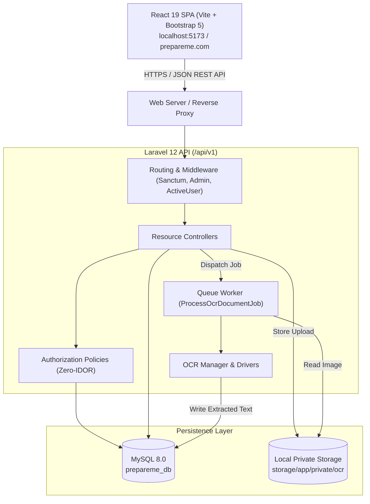
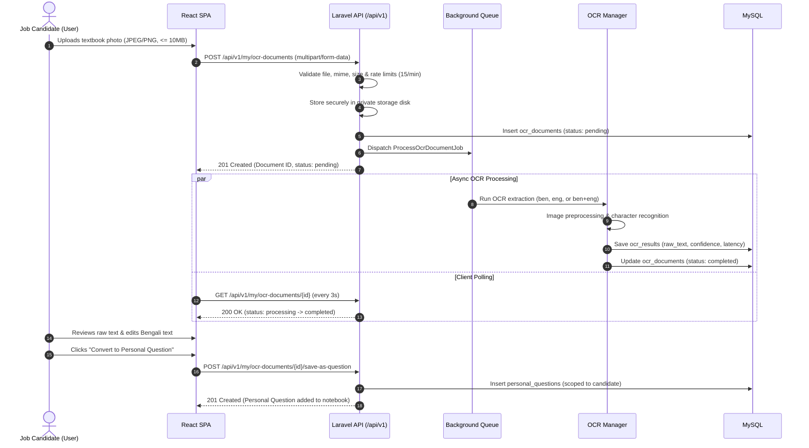

# System Architecture & Technical Design — PrepareMe.com

## 1. Architectural Philosophy

PrepareMe.com is built on the principle of **strict architectural decoupling**:
1. **Backend as a Pure REST API (`prepareme-api`):** A stateless API layer built on Laravel 12 using token-based authentication via Laravel Sanctum. The API exposes versioned endpoints (`/api/v1`) and emits structured JSON with consistent envelope formats.
2. **Frontend as a Single Page Application (`prepareme-web`):** An independent client application built with React 19 and Vite. The SPA manages its own client-side routing, optimistic UI states, session storage, and bilingual Bengali/English rendering.
3. **Strict Privacy & Zero IDOR Guarantee:** The system rigorously isolates public curriculum content from private user assets. A user's personal notebook, bookmarks, reading status, and scanned OCR textbook pages are strictly owned and accessible only by that specific candidate. Even system administrators cannot view or mutate candidates' personal notebook questions.

---

## 2. High-Level Component Architecture



---

## 3. Core Subsystems & Workflows

### 3.1 Authentication & Authorization Subsystem
* **Token Standard:** Laravel Sanctum generates personal access tokens stored in `localStorage` (`prepareme_token`).
* **Roles:** Exactly two roles exist in the system:
  * `admin`: Platform managers responsible for publishing subjects, topics, study guides, maintaining public MCQs, monitoring system health, and auditing users.
  * `user`: Job candidates who navigate public curriculum, bookmark study materials, log reading progress, upload textbook pages to OCR, and maintain a private question notebook.
* **Account Lifecycle:** Users can be `active` or `suspended`. The `EnsureActiveUser` middleware blocks access if an account is flagged.

---

### 3.2 OCR Digitization Pipeline

The OCR pipeline converts physical study book photographs into editable, digital questions without degrading server responsiveness:



#### OCR Engine Abstraction (`OcrManager`)
The system employs the Strategy Pattern for OCR execution:
1. `OcrEngineInterface`: Defines the standardized contract `process(string $filePath, string $language): OcrResultDto`.
2. `DevOcrDriver`: Built-in local fallback that inspects image dimensions and generates authentic Bengali and English job-preparation extracts with confidence scores, allowing seamless local development.
3. `TesseractDriver`: Production driver that executes the local Tesseract binary with trained Bengali (`ben`) and English (`eng`) models.
4. Extensible to cloud providers (Google Cloud Vision, AWS Textract) by registering new drivers in `OcrManager.php`.

---

### 3.3 Zero-IDOR Security Matrix

To prevent Insecure Direct Object References (IDOR):

| Entity | Public Access | Owner (`user_id`) Access | Non-Owner User Access | Admin Access |
|---|---|---|---|---|
| **Subjects / Topics** | Read (Published) | Read | Read | Full CRUD |
| **Study Guides** | Read (Published) | Read | Read | Full CRUD |
| **Public Questions** | Read (Published) | Read | Read | Full CRUD |
| **Personal Questions** | None | Full CRUD | **403 Forbidden** | **403 Forbidden** |
| **Bookmarks** | None | Read / Create / Delete | **403 Forbidden** | **403 Forbidden** |
| **Reading Progress** | None | Read / Update | **403 Forbidden** | **403 Forbidden** |
| **OCR Documents** | None | Upload / View / Edit / Convert | **403 Forbidden** | View Audit Log Only |

All personal notebook queries enforce strict ownership at the Eloquent query layer:
```php
$user->personalQuestions()->where('id', $id)->firstOrFail();
```
Coupled with dedicated Laravel Policies (`PersonalQuestionPolicy`, `OcrDocumentPolicy`).

---

## 4. Scalability & Resilience

1. **Storage Isolation:** Uploaded scans are saved to `storage/app/private/ocr/{user_id}/` outside the public web root. Direct HTTP access to raw images is impossible.
2. **Queue Resilience:** The `ProcessOcrDocumentJob` includes automatic retries (`$tries = 3`) and a `failed()` lifecycle hook that marks the document as `failed` and logs detailed stack traces into `ocr_documents.error_message`.
3. **Rate Limiting:**
   * Auth endpoints: `6 requests per minute`.
   * OCR Upload endpoint: `15 requests per minute per candidate`.
   * General API: `60 requests per minute`.
4. **Bilingual Typography:** Frontend styles utilize native `Hind Siliguri` and `Kalpurush` font stacks for crisp rendering of Bengali conjunct letters (যুক্তবর্ণ) and mathematical symbols.
