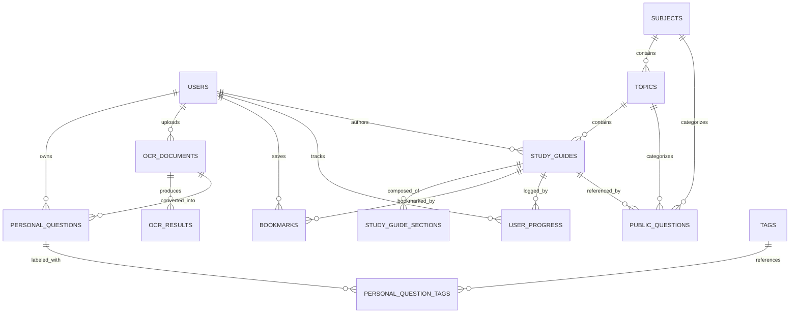

# Database Design & Schema Specification — PrepareMe.com

## 1. Overview & Engine Standards

* **Database Engine:** MySQL 8.0+ / MariaDB 10.5+
* **Storage Engine:** InnoDB (ACID compliant, row-level locking, foreign key integrity)
* **Character Set:** `utf8mb4`
* **Collation:** `utf8mb4_unicode_ci` (required for accurate Bengali character collation, sorting, and full-text search)
* **Naming Conventions:** Lowercase snake_case for tables and columns; singular foreign keys with `_id` suffix.

---

## 2. Entity-Relationship Diagram (ERD)

---

## 3. Detailed Table Definitions

### 3.1 `users`
Stores candidate accounts and platform administrators.

| Column | Type | Constraints | Description |
|---|---|---|---|
| `id` | BIGINT UNSIGNED | PK, AUTO_INCREMENT | Unique user identifier |
| `name` | VARCHAR(255) | NOT NULL | Full name of user |
| `email` | VARCHAR(255) | NOT NULL, UNIQUE | Primary login identifier |
| `password` | VARCHAR(255) | NOT NULL | Bcrypt hashed password |
| `role` | ENUM('admin', 'user') | NOT NULL, DEFAULT 'user' | System role |
| `status` | ENUM('active', 'suspended') | NOT NULL, DEFAULT 'active' | Account lifecycle status |
| `phone` | VARCHAR(20) | NULLABLE | Contact number (Bangladeshi format) |
| `target_exam` | VARCHAR(100) | NULLABLE | E.g., '47th BCS', 'Primary Teacher' |
| `remember_token` | VARCHAR(100) | NULLABLE | Laravel remember token |
| `email_verified_at` | TIMESTAMP | NULLABLE | Email verification timestamp |
| `created_at` | TIMESTAMP | NULLABLE | Record creation time |
| `updated_at` | TIMESTAMP | NULLABLE | Record update time |

* **Indexes:** `users_email_unique` (`email`), `users_role_status_index` (`role`, `status`).

---

### 3.2 `subjects`
High-level syllabus subjects (e.g., বাংলা ভাষা ও সাহিত্য, গণিত, বাংলাদেশ বিষয়াবলী).

| Column | Type | Constraints | Description |
|---|---|---|---|
| `id` | BIGINT UNSIGNED | PK, AUTO_INCREMENT | Subject identifier |
| `name` | VARCHAR(255) | NOT NULL | Bengali/English subject name |
| `slug` | VARCHAR(255) | NOT NULL, UNIQUE | URL-safe slug |
| `description` | TEXT | NULLABLE | Subject curriculum summary |
| `icon` | VARCHAR(100) | NULLABLE | Bootstrap icon class |
| `sort_order` | INT | NOT NULL, DEFAULT 0 | Display sequence order |
| `status` | ENUM('draft', 'published', 'archived') | NOT NULL, DEFAULT 'published' | Publishing status |
| `created_at`, `updated_at` | TIMESTAMP | NULLABLE | Timestamps |

* **Indexes:** `subjects_slug_unique` (`slug`), `subjects_status_sort_order_index` (`status`, `sort_order`).

---

### 3.3 `topics`
Subdivided areas of a subject (e.g., প্রাচীন ও মধ্যযুগ, শতকরা ও লাভ-ক্ষতি).

| Column | Type | Constraints | Description |
|---|---|---|---|
| `id` | BIGINT UNSIGNED | PK, AUTO_INCREMENT | Topic identifier |
| `subject_id` | BIGINT UNSIGNED | NOT NULL, FK -> `subjects(id)` CASCADE | Parent subject |
| `name` | VARCHAR(255) | NOT NULL | Topic title |
| `slug` | VARCHAR(255) | NOT NULL | URL slug (unique per subject) |
| `description` | TEXT | NULLABLE | Topic overview |
| `sort_order` | INT | NOT NULL, DEFAULT 0 | Ordering within subject |
| `status` | ENUM('draft', 'published', 'archived') | NOT NULL, DEFAULT 'published' | Publishing status |
| `created_at`, `updated_at` | TIMESTAMP | NULLABLE | Timestamps |

* **Indexes:** `topics_subject_id_slug_unique` (`subject_id`, `slug`), `topics_subject_id_sort_order_index` (`subject_id`, `sort_order`).

---

### 3.4 `study_guides`
In-depth study chapters written by administrators.

| Column | Type | Constraints | Description |
|---|---|---|---|
| `id` | BIGINT UNSIGNED | PK, AUTO_INCREMENT | Study guide identifier |
| `topic_id` | BIGINT UNSIGNED | NOT NULL, FK -> `topics(id)` CASCADE | Belongs to topic |
| `title` | VARCHAR(255) | NOT NULL | Chapter/Guide title |
| `slug` | VARCHAR(255) | NOT NULL | Unique per topic |
| `summary` | TEXT | NULLABLE | Brief executive summary |
| `estimated_read_time` | INT | NOT NULL, DEFAULT 5 | Reading time in minutes |
| `status` | ENUM('draft', 'published', 'archived') | NOT NULL, DEFAULT 'draft' | Publishing state |
| `published_at` | TIMESTAMP | NULLABLE | Time guide became visible |
| `created_by` | BIGINT UNSIGNED | NOT NULL, FK -> `users(id)` | Author user |
| `created_at`, `updated_at` | TIMESTAMP | NULLABLE | Timestamps |

* **Indexes:** `study_guides_topic_id_status_index` (`topic_id`, `status`).

---

### 3.5 `study_guide_sections`
Modular content blocks forming a study guide.

| Column | Type | Constraints | Description |
|---|---|---|---|
| `id` | BIGINT UNSIGNED | PK, AUTO_INCREMENT | Section identifier |
| `study_guide_id` | BIGINT UNSIGNED | NOT NULL, FK -> `study_guides(id)` CASCADE | Parent study guide |
| `title` | VARCHAR(255) | NULLABLE | Section heading |
| `section_type` | ENUM('text', 'key_points', 'example', 'warning', 'formula', 'faq') | NOT NULL, DEFAULT 'text' | Semantic block type |
| `content` | LONGTEXT | NOT NULL | Bengali/English body content |
| `sort_order` | INT | NOT NULL, DEFAULT 0 | Sequence within guide |
| `created_at`, `updated_at` | TIMESTAMP | NULLABLE | Timestamps |

* **Indexes:** `study_guide_sections_guide_sort_index` (`study_guide_id`, `sort_order`).

---

### 3.6 `public_questions`
Curated question bank with MCQs, answers, and explanations.

| Column | Type | Constraints | Description |
|---|---|---|---|
| `id` | BIGINT UNSIGNED | PK, AUTO_INCREMENT | Question identifier |
| `subject_id` | BIGINT UNSIGNED | NOT NULL, FK -> `subjects(id)` CASCADE | Subject association |
| `topic_id` | BIGINT UNSIGNED | NULLABLE, FK -> `topics(id)` SET NULL | Optional topic association |
| `study_guide_id` | BIGINT UNSIGNED | NULLABLE, FK -> `study_guides(id)` SET NULL | Optional guide link |
| `question` | TEXT | NOT NULL | Question stem |
| `answer` | TEXT | NOT NULL | Correct answer text |
| `explanation` | TEXT | NULLABLE | Contextual solution explanation |
| `question_type` | ENUM('short_answer', 'mcq', 'true_false') | NOT NULL, DEFAULT 'mcq' | Question category |
| `options` | JSON | NULLABLE | Array of choices `['A...', 'B...', ...]` |
| `correct_option` | VARCHAR(50) | NULLABLE | Selected choice key (e.g., 'A', 'B') |
| `difficulty` | ENUM('easy', 'medium', 'hard') | NOT NULL, DEFAULT 'medium' | Exam difficulty tier |
| `status` | ENUM('draft', 'published', 'archived') | NOT NULL, DEFAULT 'published' | Visibility |
| `created_by` | BIGINT UNSIGNED | NOT NULL, FK -> `users(id)` | Author |
| `updated_by` | BIGINT UNSIGNED | NULLABLE, FK -> `users(id)` | Last editor |
| `created_at`, `updated_at` | TIMESTAMP | NULLABLE | Timestamps |

* **Indexes:** `public_questions_search_index` (`subject_id`, `difficulty`, `status`).

---

### 3.7 `ocr_documents`
Tracking uploaded textbook scans and extraction pipeline lifecycle.

| Column | Type | Constraints | Description |
|---|---|---|---|
| `id` | BIGINT UNSIGNED | PK, AUTO_INCREMENT | Document identifier |
| `user_id` | BIGINT UNSIGNED | NOT NULL, FK -> `users(id)` CASCADE | Uploading candidate |
| `original_filename` | VARCHAR(255) | NOT NULL | Client filename |
| `file_path` | VARCHAR(500) | NOT NULL | Storage path in private disk |
| `file_size` | INT UNSIGNED | NOT NULL | Size in bytes |
| `mime_type` | VARCHAR(100) | NOT NULL | E.g. 'image/jpeg', 'image/png' |
| `language` | ENUM('ben', 'eng', 'ben+eng') | NOT NULL, DEFAULT 'ben+eng' | Requested language pack |
| `status` | ENUM('pending', 'processing', 'completed', 'failed') | NOT NULL, DEFAULT 'pending' | Processing stage |
| `error_message` | TEXT | NULLABLE | Extraction failure reason |
| `created_at`, `updated_at` | TIMESTAMP | NULLABLE | Timestamps |

* **Indexes:** `ocr_documents_user_status_index` (`user_id`, `status`).

---

### 3.8 `ocr_results`
Stores raw extracted text and processing metrics per run.

| Column | Type | Constraints | Description |
|---|---|---|---|
| `id` | BIGINT UNSIGNED | PK, AUTO_INCREMENT | Result identifier |
| `ocr_document_id` | BIGINT UNSIGNED | NOT NULL, FK -> `ocr_documents(id)` CASCADE | Associated scan |
| `raw_text` | LONGTEXT | NOT NULL | Extracted optical text |
| `confidence` | DECIMAL(5,2) | NULLABLE | Average character confidence (0-100%) |
| `processing_time_ms` | INT UNSIGNED | NULLABLE | Engine execution latency |
| `engine` | VARCHAR(50) | NOT NULL | Driver identifier (dev, tesseract, vision) |
| `meta` | JSON | NULLABLE | Bounding boxes or word coordinates |
| `created_at`, `updated_at` | TIMESTAMP | NULLABLE | Timestamps |

---

### 3.9 `personal_questions`
Candidate's private notebook of study questions.

| Column | Type | Constraints | Description |
|---|---|---|---|
| `id` | BIGINT UNSIGNED | PK, AUTO_INCREMENT | Notebook question identifier |
| `user_id` | BIGINT UNSIGNED | NOT NULL, FK -> `users(id)` CASCADE | Owner candidate |
| `ocr_document_id` | BIGINT UNSIGNED | NULLABLE, FK -> `ocr_documents(id)` SET NULL | Source scan reference |
| `study_guide_id` | BIGINT UNSIGNED | NULLABLE, FK -> `study_guides(id)` SET NULL | Syllabus link |
| `question` | TEXT | NOT NULL | Candidate's question |
| `answer` | TEXT | NOT NULL | Candidate's answer |
| `explanation` | TEXT | NULLABLE | Candidate's revision notes |
| `source` | VARCHAR(255) | NULLABLE | Book title, edition, or page |
| `status` | ENUM('active', 'archived') | NOT NULL, DEFAULT 'active' | User visibility state |
| `created_at`, `updated_at` | TIMESTAMP | NULLABLE | Timestamps |

* **Indexes:** `personal_questions_user_status_index` (`user_id`, `status`).

---

### 3.10 `bookmarks` & `user_progress`

**`bookmarks`:**
* `id` BIGINT UNSIGNED PK
* `user_id` BIGINT UNSIGNED FK -> `users(id)` CASCADE
* `study_guide_id` BIGINT UNSIGNED FK -> `study_guides(id)` CASCADE
* Unique Index: (`user_id`, `study_guide_id`)

**`user_progress`:**
* `id` BIGINT UNSIGNED PK
* `user_id` BIGINT UNSIGNED FK -> `users(id)` CASCADE
* `study_guide_id` BIGINT UNSIGNED FK -> `study_guides(id)` CASCADE
* `status` ENUM('started', 'completed') DEFAULT 'started'
* `last_read_at` TIMESTAMP
* Unique Index: (`user_id`, `study_guide_id`)
